<p align="center">
  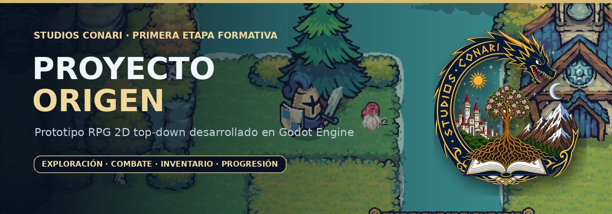
</p>

<p align="center">
  <strong>Primera etapa de aprendizaje técnico de Studios Conari</strong><br>
  Prototipo formativo creado para comprender la arquitectura, las mecánicas y el flujo de producción de un videojuego RPG 2D top-down.
</p>

<p align="center">
  
  
  
  
  
</p>

<p align="center">
  <a href="#-descripción">Descripción</a> ·
  <a href="#-por-qué-existe-proyecto-origen">Propósito</a> ·
  <a href="#-demostración">Demostración</a> ·
  <a href="#-sistemas-implementados">Sistemas</a> ·
  <a href="#-transferencia-hacia-vilu">VILU</a> ·
  <a href="#-studios-conari">El estudio</a>
</p>

---

# 📖 Descripción

**Proyecto Origen** es un prototipo formativo de videojuego **RPG 2D top-down**, desarrollado por **Studios Conari SpA** como la primera etapa de un proceso de aprendizaje aplicado y construcción progresiva de capacidades para el desarrollo de videojuegos.

El proyecto fue creado para estudiar cómo se relacionan, dentro de una misma experiencia interactiva:

- el control de personajes;
- la exploración de escenarios;
- el combate;
- la inteligencia y navegación de enemigos;
- la salud y el daño;
- el inventario;
- el equipamiento;
- las estadísticas;
- las habilidades;
- la progresión;
- el botín;
- las interfaces;
- el ciclo de muerte y reaparición;
- la organización interna de un proyecto en Godot Engine.

Su finalidad principal no fue producir un videojuego comercial terminado.

Proyecto Origen funciona como un **laboratorio técnico**, una evidencia de portafolio y un registro del proceso mediante el cual el estudio comenzó a transformar conocimientos teóricos en sistemas funcionales.

---

# ℹ️ Información general

| Categoría | Información |
|---|---|
| **Nombre** | Proyecto Origen |
| **Desarrollador** | Studios Conari SpA |
| **Origen** | Concepción, Región del Biobío, Chile |
| **Tipo de proyecto** | Prototipo formativo y laboratorio técnico |
| **Género** | RPG 2D top-down |
| **Perspectiva** | Vista superior |
| **Jugadores** | Un jugador |
| **Motor** | Godot Engine 4.5 |
| **Lenguaje** | GDScript |
| **Plataforma de desarrollo** | PC |
| **Estado** | Desarrollo pausado |
| **Finalidad pública** | Portafolio, documentación y demostración técnica |
| **Proyección comercial actual** | No contemplada |
| **Recursos visuales** | Material de prototipado y recursos de terceros acreditados |

---

# ⚠️ Aviso sobre recursos visuales de terceros

Proyecto Origen utiliza recursos visuales pertenecientes al paquete **Tiny Swords**, creado por **Pixel Frog**.

Studios Conari SpA:

- **no es autor ni titular** de esos sprites, tilesets, edificios, personajes, efectos o elementos de interfaz;
- no atribuye esos recursos a su propiedad intelectual;
- los utilizó como apoyo visual durante un proceso de **investigación, aprendizaje, prototipado y desarrollo técnico**;
- publica este repositorio con fines de **portafolio, documentación, evaluación y demostración técnica**, no como producto comercial ni como biblioteca de recursos;
- mantiene separados los derechos sobre su código, documentación y trabajo de integración de los derechos correspondientes a Pixel Frog.

> [!WARNING]
> El carácter educativo, formativo o no comercial de este repositorio **no reemplaza ni modifica la licencia de Tiny Swords**. La licencia permite usar y modificar los recursos dentro de proyectos, pero prohíbe redistribuirlos, revenderlos o reempaquetarlos, incluso cuando hayan sido modificados.

Por esta razón, la versión pública del repositorio debe excluir:

- archivos PNG originales del paquete;
- spritesheets;
- archivos `.aseprite`;
- carpetas completas de Tiny Swords;
- archivos modificados derivados directamente del paquete cuando su publicación permita recuperarlos como recursos independientes;
- copias del Free Pack o del Enemy Pack;
- cualquier archivo cuya inclusión equivalga a redistribuir el material de Pixel Frog.

La publicación pública puede contener:

- código desarrollado por Studios Conari;
- documentación;
- capturas de pantalla;
- video de demostración;
- diagramas;
- información técnica;
- recursos propios;
- archivos provisionales cuya licencia permita su distribución.

Las capturas y videos se muestran únicamente como evidencia del funcionamiento del prototipo y **no autorizan la extracción, reutilización o redistribución de los recursos visuales representados**.

Consulta [`THIRD_PARTY_ASSETS.md`](THIRD_PARTY_ASSETS.md) para conocer el alcance de estos resguardos y la fuente oficial de los recursos.

---

# 🌱 ¿Por qué existe Proyecto Origen?

Antes de iniciar la producción de una obra propia de mayor alcance, Studios Conari necesitaba responder una pregunta fundamental:

> **¿Cómo se construyen e integran los sistemas esenciales de un videojuego RPG 2D top-down dentro de Godot Engine?**

El estudio decidió no abordar esa pregunta únicamente mediante tutoriales o documentación teórica.

En su lugar, desarrolló un prototipo que obligara a conectar distintas áreas técnicas dentro de una experiencia funcional.

Proyecto Origen permitió investigar preguntas concretas:

> ¿Cómo se organiza un videojuego mediante escenas, nodos y scripts reutilizables?

> ¿Cómo se controla un personaje dentro de un escenario top-down?

> ¿Cómo se detectan colisiones, ataques y recepción de daño?

> ¿Cómo se conectan estadísticas, equipamiento y valores derivados?

> ¿Cómo se representa un inventario sin separar la lógica de los datos?

> ¿Cómo se comportan los enemigos cuando deben detectar, perseguir, atacar, regresar y reaparecer?

> ¿Cómo se sincroniza la interfaz con los cambios producidos durante el gameplay?

> ¿Cómo puede organizarse un proyecto para que sus sistemas puedan ampliarse posteriormente?

Cada una de estas preguntas fue explorada mediante una implementación práctica incorporada al prototipo.

---

# 🧭 ¿Por qué fue el primer proyecto del estudio?

Studios Conari seleccionó un **RPG 2D top-down** como primera experiencia formativa porque este tipo de proyecto permite estudiar una gran variedad de sistemas sin comenzar con la complejidad visual y productiva de un videojuego 3D.

La elección permitió combinar:

### Un entorno 2D controlable

La producción 2D hizo posible concentrar el aprendizaje en:

- escenas;
- colisiones;
- navegación;
- interfaces;
- datos;
- estados;
- interacción entre sistemas.

### Una perspectiva top-down

La vista superior permitió estudiar:

- movimiento multidireccional;
- lectura espacial;
- diseño de áreas;
- persecución de enemigos;
- separación entre zonas navegables;
- interacción con objetos y entidades;
- combate en tiempo real.

### Una estructura RPG

El género RPG exige que diferentes sistemas se relacionen entre sí:

```text
Combate
   │
   ▼
Experiencia ──► Nivel
   │              │
   │              ▼
   └────────► Estadísticas
                  │
                  ▼
Equipo ──────► Daño y defensa
                  │
                  ▼
Habilidades ◄── Puntos de progresión
```

Esta interdependencia convirtió al proyecto en una base adecuada para aprender no solo una mecánica aislada, sino la integración entre gameplay, datos e interfaz.

### Godot Engine como motor de aprendizaje

Godot fue escogido para estudiar:

- arquitectura basada en escenas y nodos;
- composición de comportamientos;
- señales;
- recursos;
- autoloads;
- interfaces 2D;
- navegación;
- animación;
- programación mediante GDScript;
- exportación y organización de proyectos.

El mismo motor fue seleccionado posteriormente para el desarrollo de **VILU**, por lo que la experiencia obtenida posee una relación directa con la futura producción.

---

# 🧪 Metodología de desarrollo del estudio

Proyecto Origen representa el comienzo de una metodología basada en **aprender mediante prototipos verificables**.

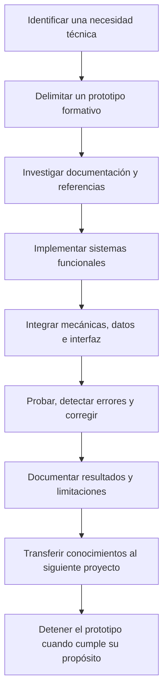

Esta estructura evita mantener indefinidamente proyectos cuyo objetivo principal ya fue alcanzado.

El estudio distingue entre:

- **prototipos de aprendizaje**, destinados a resolver incertidumbres;
- **preproducción**, destinada a definir una obra propia;
- **producción**, destinada a crear un producto coherente y publicable;
- **documentación**, destinada a conservar y transferir el conocimiento obtenido.

---

# 🔄 Evolución del aprendizaje

Proyecto Origen no se encuentra aislado. Forma parte de una progresión acumulativa.

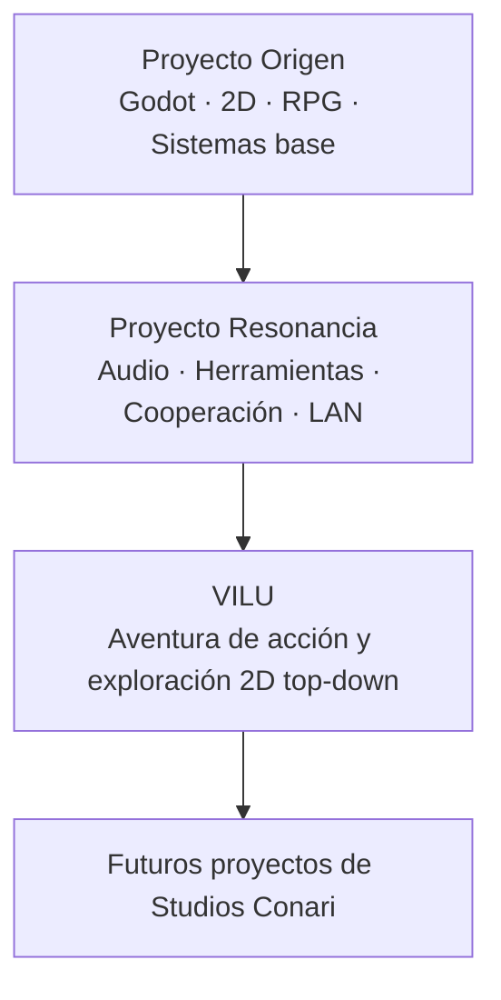

### Proyecto Origen

Permitió estudiar fundamentos de gameplay, estructura de un RPG, escenas, inventario, progresión, enemigos e interfaz.

### Proyecto Resonancia

Amplió el aprendizaje hacia lectura y transformación de archivos, herramientas internas, análisis de audio, cooperación local y fundamentos de red.

### VILU

Integra los aprendizajes útiles dentro de una obra original con identidad narrativa, artística y cultural propia.

La transferencia entre proyectos no implica copiar todo el código sin cambios.

El valor principal se encuentra en:

- comprender problemas previamente desconocidos;
- reconocer arquitecturas útiles;
- detectar errores de diseño;
- mejorar la planificación;
- reducir incertidumbres;
- definir qué sistemas deben reconstruirse con estándares de producción.

---

# ⏸️ Estado actual

> [!IMPORTANT]
> **Proyecto Origen se encuentra actualmente pausado.**

El prototipo alcanzó un nivel suficiente para:

- comprobar sus sistemas principales;
- demostrar conocimientos básicos de Godot;
- documentar la integración de mecánicas RPG;
- respaldar el portafolio técnico de Studios Conari;
- identificar aprendizajes aplicables a VILU;
- dar paso a nuevas etapas de investigación y preproducción.

No se presenta como:

- videojuego comercial terminado;
- versión definitiva;
- demo pública de un proyecto futuro;
- dirección artística final del estudio;
- producto listo para distribución;
- referencia de balance definitivo;
- paquete de assets reutilizables.

| Área | Estado |
|---|---|
| Movimiento top-down | ✅ Implementado |
| Combate básico | ✅ Implementado |
| Habilidad especial | ✅ Implementada |
| Salud, SP y daño | ✅ Implementados |
| Enemigos y persecución | ✅ Implementados |
| Navegación | ✅ Implementada |
| Inventario | ✅ Implementado |
| Equipamiento | ✅ Implementado |
| Consumibles | ✅ Implementados |
| Estadísticas | ✅ Implementadas |
| Habilidades | ✅ Implementadas |
| Experiencia y niveles | ✅ Implementados |
| Botín y monedas | ✅ Implementados |
| HUD e interfaces | ✅ Implementados |
| Muerte y reaparición | ✅ Implementadas |
| Guardado persistente completo | ➖ No consolidado como sistema final |
| Multijugador | ➖ Fuera del alcance de esta etapa |
| Producción activa | ⏸️ Pausada |
| Proyección comercial actual | ➖ No contemplada |

---

# 🎬 Demostración

<p align="center">
  <a href="docs/media/ProyectoOrigen.mp4">
    
  </a>
</p>

<p align="center">
  <sub>Haz clic sobre la demostración para abrir el video completo.</sub>
</p>

La secuencia muestra material real del prototipo:

- desplazamiento por el escenario;
- exploración;
- interacción con entidades;
- combate;
- comportamiento de enemigos;
- recepción de daño;
- inventario;
- equipamiento;
- consumibles;
- estadísticas;
- habilidades;
- barra de acciones;
- tooltips;
- estados de muerte y reaparición.

---

# ✨ Capacidades principales

### Exploración

- Movimiento en ocho direcciones.
- Escenarios top-down.
- Colisiones.
- Zonas navegables.
- Diferentes niveles visuales de altura.
- Cámara centrada en el personaje.
- Entidades distribuidas en el mundo.

### Combate

- Ataque básico.
- Habilidad especial.
- Consumo de SP.
- Daño físico.
- Recepción de daño.
- Invulnerabilidad temporal.
- Retroceso.
- Números de daño.
- Muerte y reaparición.

### Enemigos

- Detección.
- Persecución.
- Ataque.
- Distancia mínima.
- Regreso a posición inicial.
- Navegación.
- Salud.
- Muerte.
- Respawn.
- Recompensas.

### Inventario

- Casillas.
- Objetos apilables.
- Consumibles.
- Equipo.
- Espíritus.
- Monedas.
- Barra de acciones.
- Tooltips.
- Uso de objetos.
- Equipamiento y desequipamiento.

### Progresión

- Nivel base.
- Nivel de clase.
- Experiencia independiente.
- Fuerza.
- Destreza.
- Inteligencia.
- Puntos de estadística.
- Puntos de habilidad.
- Atributos derivados.
- Bonificaciones de equipo.

### Interfaz

- HUD.
- HP.
- SP.
- Experiencia.
- Inventario.
- Equipo.
- Estadísticas.
- Habilidades.
- Tooltips.
- Menú principal.
- Pantallas superpuestas.
- Game over.

---

# 🧩 Sistemas implementados

<table>
  <tr>
    <td width="50%" valign="top">
      <h3>🗺️ Exploración top-down</h3>
      <p>Movimiento multidireccional, colisiones, navegación por escenarios, lectura espacial y organización del mundo mediante escenas.</p>
    </td>
    <td width="50%" valign="top">
      <h3>⚔️ Combate</h3>
      <p>Ataque básico, habilidad especial, consumo de SP, recepción de daño, invulnerabilidad temporal, retroceso y números de daño.</p>
    </td>
  </tr>
  <tr>
    <td width="50%" valign="top">
      <h3>🤖 Enemigos y entidades</h3>
      <p>Máquina de estados para reposo, detección, persecución, ataque, retorno y muerte, junto con navegación, respawn y recompensas.</p>
    </td>
    <td width="50%" valign="top">
      <h3>🎒 Inventario y equipo</h3>
      <p>Inventario por casillas, equipamiento, consumibles, monedas, espíritus, barra de acciones, cantidades apilables y tooltips.</p>
    </td>
  </tr>
  <tr>
    <td width="50%" valign="top">
      <h3>📈 Progresión</h3>
      <p>Nivel base y nivel de clase, experiencia, puntos de estadísticas, fuerza, destreza, inteligencia y atributos derivados.</p>
    </td>
    <td width="50%" valign="top">
      <h3>✨ Habilidades</h3>
      <p>Sistema de puntos de habilidad, niveles de mejora, cálculo progresivo de daño y visualización de requisitos.</p>
    </td>
  </tr>
  <tr>
    <td width="50%" valign="top">
      <h3>💰 Botín y recompensas</h3>
      <p>Tablas de loot con probabilidades, cantidades variables, equipo, fragmentos, núcleos, monedas y objetos recogibles.</p>
    </td>
    <td width="50%" valign="top">
      <h3>🖥️ Interfaz y ciclo de juego</h3>
      <p>HUD, barras, experiencia, ventanas, muerte, vidas, reaparición, reinicio y estados de derrota.</p>
    </td>
  </tr>
</table>

---

# 🖼️ Galería

<p align="center">
  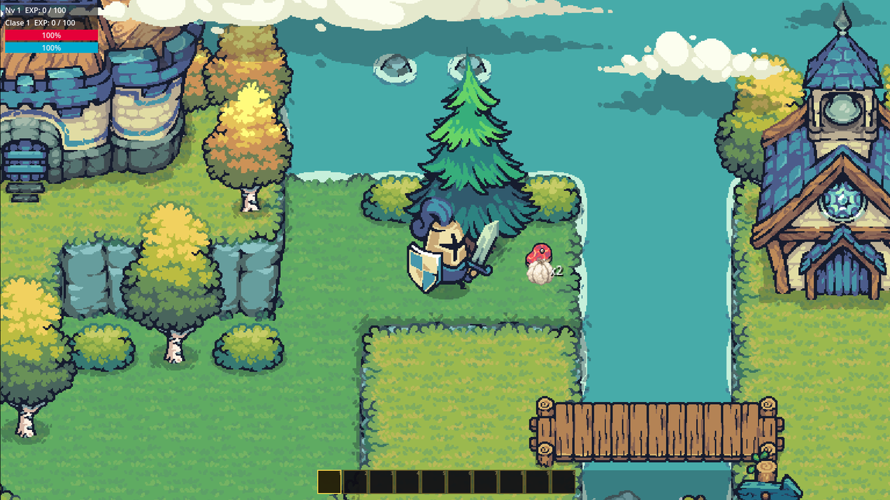
  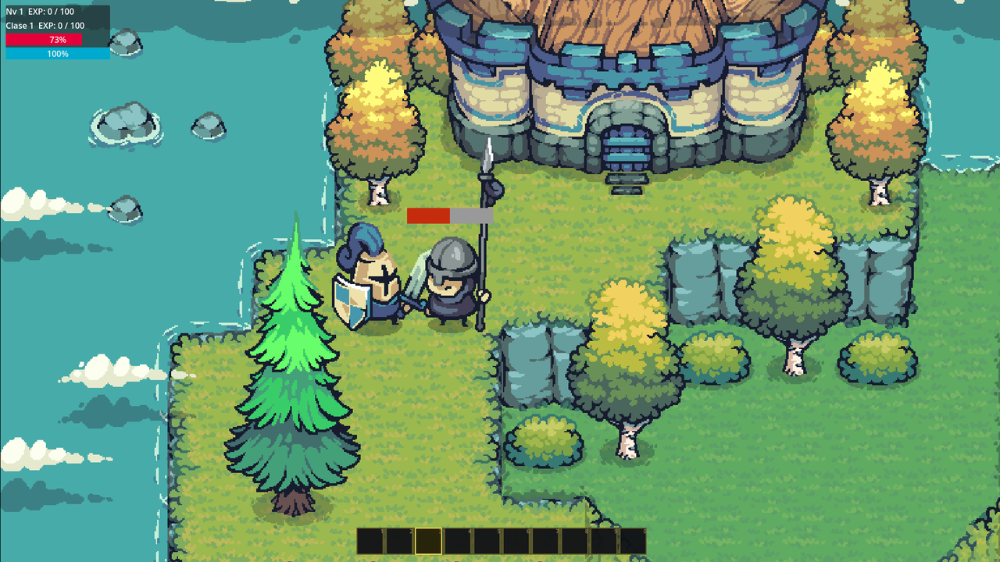
</p>

<p align="center">
  <sub>Exploración del escenario y comportamiento de combate.</sub>
</p>

<p align="center">
  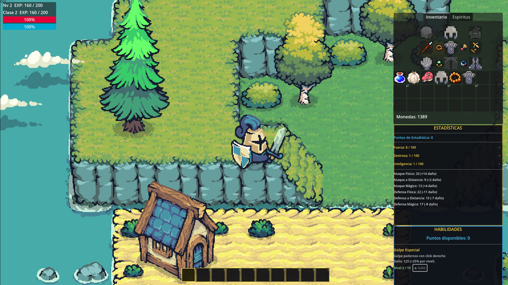
  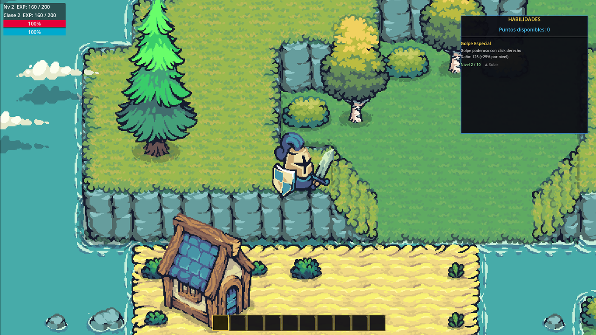
</p>

<p align="center">
  <sub>Gestión de inventario, equipamiento, progresión y habilidades.</sub>
</p>

<p align="center">
  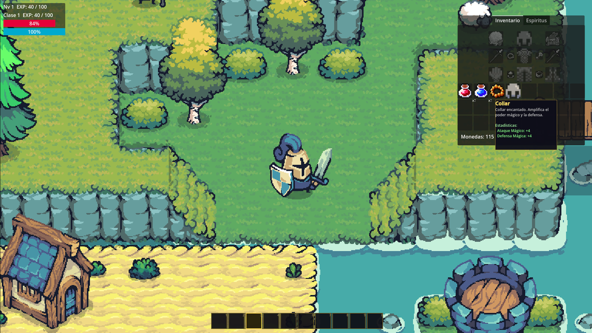
  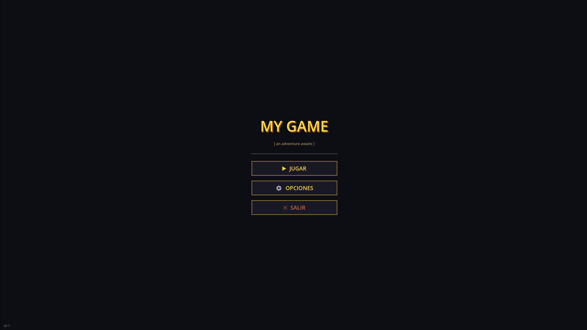
</p>

<p align="center">
  <sub>Información contextual de objetos y flujo inicial de la aplicación.</sub>
</p>

---

# 🎮 Controles

| Acción | Control |
|---|---|
| Movimiento | `WASD` o flechas direccionales |
| Ataque básico | Clic izquierdo |
| Golpe especial | Clic derecho |
| Abrir o cerrar inventario | `I` |
| Abrir o cerrar estadísticas | `C` |
| Abrir o cerrar habilidades | `H` |
| Seleccionar casilla de la barra | `1`–`0` o rueda del mouse |
| Usar consumible seleccionado | `E` |

---

# 🏗️ Arquitectura técnica

El proyecto utiliza una organización modular basada en escenas reutilizables, componentes y autoloads.

```text
ProyectoOrigen/
├── Assets/                      Recursos visuales e iconografía
├── Components/                  Componentes reutilizables
├── Scenes/                      Mundo, jugador, enemigos e interfaces
├── Scripts/
│   ├── Animales/                Entidades no hostiles
│   ├── Base/                    HUD, estadísticas, habilidades y UI
│   ├── Enemigos/                Estados, navegación, combate y loot
│   ├── Mecanicas/               Inventario, objetos y tablas de botín
│   └── Personaje Principal/     Movimiento, combate, SP y reaparición
├── project.godot                Configuración principal
├── CREDITS.md                   Créditos y recursos de terceros
└── README.md
```

## Autoloads principales

| Autoload | Responsabilidad |
|---|---|
| `Inventory` | Inventario, equipo, espíritus, monedas y barra de acciones |
| `Stats` | Niveles, experiencia, estadísticas, habilidades y bonificaciones |
| `ItemTooltip` | Información contextual de objetos |
| `UiManager` | Coordinación de ventanas e interfaces |

## Flujo general de los sistemas

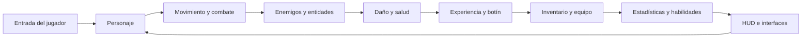

## Decisiones técnicas estudiadas

- Separación entre nivel base y nivel de clase.
- Estadísticas primarias y valores derivados.
- Bonificaciones aplicadas mediante equipamiento.
- Máquina de estados para enemigos.
- Navegación mediante `NavigationAgent2D`.
- Componentes reutilizables de salud.
- Señales para sincronizar UI, estadísticas e inventario.
- Recursos y tablas para representar objetos.
- Probabilidades de botín.
- Interfaces superpuestas.
- Reaparición de jugador y enemigos.
- Escenas instanciables.
- Autoloads para sistemas globales.

---

# 🛠️ Tecnologías y conceptos estudiados

| Tecnología o concepto | Aplicación en Proyecto Origen |
|---|---|
| **Godot Engine 4.5** | Motor principal |
| **GDScript** | Programación de gameplay y sistemas |
| **Node2D / CharacterBody2D** | Entidades y movimiento |
| **Control** | Interfaces |
| **Signals** | Comunicación desacoplada |
| **Autoloads** | Sistemas globales |
| **Resources** | Representación de datos |
| **NavigationAgent2D** | Persecución y movimiento de enemigos |
| **AnimationPlayer / AnimatedSprite2D** | Animación de entidades |
| **CollisionShape2D / áreas** | Detección e interacción |
| **Máquinas de estados** | Comportamiento de enemigos |
| **Composición de escenas** | Reutilización de elementos |
| **Tablas de datos** | Objetos, loot y estadísticas |
| **Git y GitHub** | Control de versiones y portafolio |

---

# 🧠 Capacidades desarrolladas

## Godot Engine

- Comprensión de la interfaz del editor.
- Creación e instanciación de escenas.
- Uso de nodos.
- Configuración de señales.
- Gestión de recursos.
- Uso de autoloads.
- Organización de carpetas.
- Depuración de errores.
- Integración entre gameplay y UI.

## Diseño de sistemas

- Separación de responsabilidades.
- Flujo entre combate y progresión.
- Diseño de inventario.
- Equipamiento.
- Estadísticas derivadas.
- Habilidades.
- Tablas de botín.
- Ciclo de muerte y reaparición.

## Diseño de gameplay

- Movimiento top-down.
- Lectura de espacio.
- Interacción con enemigos.
- Retroalimentación visual.
- Consumo de recursos.
- Progresión.
- Uso de objetos.
- Balance preliminar.

## Producción

- Delimitación de alcance.
- Prototipado.
- Pruebas.
- Corrección de errores.
- Documentación.
- Identificación de sistemas reutilizables.
- Distinción entre prototipo y producto final.

---

# 🔁 Transferencia hacia VILU

VILU se proyecta como una aventura de acción y exploración en 2D con perspectiva top-down, desarrollada en Godot Engine.

Por esta razón, Proyecto Origen posee una relación técnica más directa con VILU que otros prototipos del estudio.

La transferencia no significa utilizar todo el proyecto sin modificaciones.

Se distinguen tres niveles:

## Transferencia directa de conocimientos

| Aprendizaje de Proyecto Origen | Aplicación potencial en VILU |
|---|---|
| Flujo de trabajo en Godot | Organización del proyecto y producción diaria |
| Escenas y nodos | Personajes, mapas, enemigos, objetos e interfaces |
| GDScript | Gameplay, sistemas y herramientas |
| Movimiento top-down | Base para desplazamiento y exploración |
| Colisiones | Mundo, obstáculos, ataques e interacciones |
| Navegación 2D | Enemigos, criaturas y acompañantes |
| Máquina de estados | IA y comportamiento contextual |
| Componentes de salud | Jugadores, enemigos y entidades |
| Daño e invulnerabilidad | Sistema de combate |
| Señales | Comunicación entre gameplay e interfaz |
| Autoloads | Sistemas globales |
| Inventario | Objetos, recursos y equipamiento |
| Datos de objetos | Catálogo de contenido |
| Estadísticas | Progresión y balance |
| HUD | Salud, energía, habilidades e información |
| Barra de acciones | Accesos rápidos y consumibles |
| Tooltips | Explicación de objetos y sistemas |

## Conocimientos adaptables

Estos aprendizajes pueden conservarse conceptualmente, pero necesitan rediseño:

- nivel base y nivel de clase;
- distribución manual de estadísticas;
- sistema de habilidad única;
- economía y monedas;
- probabilidades de botín;
- equipamiento por ranuras;
- respawn;
- game over;
- barra de acciones;
- ventanas de inventario;
- comportamiento de animales;
- fórmula de daño;
- equilibrio de atributos.

Su aplicación dependerá del diseño definitivo de VILU.

## Elementos que no deben transferirse como solución final

- recursos visuales de terceros;
- dirección artística provisional;
- nombres temporales;
- balance del prototipo;
- mapas de prueba;
- interfaz visual no definitiva;
- código que necesite refactorización;
- estructuras creadas únicamente para aprender;
- decisiones que no respondan al diseño de VILU;
- sistemas no preparados para cooperación;
- contenido sin validación narrativa o cultural.

---

# 🧱 Aplicación conjunta con Proyecto Resonancia

Proyecto Origen y Proyecto Resonancia aportan conocimientos complementarios.

| Área de VILU | Proyecto Origen | Proyecto Resonancia |
|---|---:|---:|
| Godot Engine | ✅ Base principal | ➖ No aplica directamente |
| Gameplay top-down | ✅ | ➖ |
| Combate | ✅ | ➖ |
| Inventario y progresión | ✅ | ➖ |
| IA y navegación | ✅ | ➖ |
| Interfaces | ✅ Base | ✅ Interfaces complejas |
| Cooperación local | Base conceptual del jugador | ✅ Aprendizaje específico |
| Separación de controles | ➖ | ✅ |
| LAN y red | ➖ | 🧪 Fundamentos experimentales |
| Lectura de datos externos | Base mediante recursos | ✅ Desarrollo ampliado |
| Herramientas internas | Inicial | ✅ Desarrollo ampliado |
| Internacionalización | No consolidada | ✅ Español e inglés |
| Documentación | ✅ | ✅ |

El proceso previsto no consiste en fusionar ambos proyectos.

La estrategia es:

```text
Extraer aprendizajes
        │
        ▼
Reevaluar necesidades de VILU
        │
        ▼
Diseñar una arquitectura nueva
        │
        ▼
Reimplementar únicamente lo pertinente
        │
        ▼
Probar con requisitos reales de producción
```

---

# 🎯 Cómo influye Proyecto Origen en la preproducción de VILU

Proyecto Origen permite iniciar la preproducción de VILU con una comprensión más concreta de:

- cuánto trabajo requiere integrar distintos sistemas;
- qué interfaces necesitan documentación previa;
- cómo se relacionan datos y gameplay;
- qué sistemas deben diseñarse de forma modular;
- qué decisiones deben definirse antes de producir contenido;
- qué elementos requieren herramientas internas;
- qué riesgos aparecen al mezclar lógica y presentación;
- qué partes del prototipo deben reconstruirse;
- qué conocimientos faltan todavía;
- cómo establecer prioridades técnicas.

Esto transforma el aprendizaje en planificación.

En lugar de comenzar VILU desde una idea abstracta, el estudio puede evaluar sistemas basándose en experiencia práctica previa.

---

# 🚀 Instalación y ejecución

## Requisitos

- [Godot Engine 4.5](https://godotengine.org/) o una versión compatible de Godot 4.x.
- Sistema operativo compatible con el editor de Godot.

## Abrir el proyecto

```bash
git clone https://github.com/StudiosConari/ProyectoOrigen.git
cd ProyectoOrigen
```

1. Abre **Godot Engine**.
2. Selecciona **Importar**.
3. Busca el archivo `project.godot`.
4. Importa el proyecto.
5. Ejecuta el proyecto con `F5`.

---

# 📦 Estructura del repositorio

```text
ProyectoOrigen/
├── Assets/
├── Components/
├── Scenes/
├── Scripts/
├── docs/
│   ├── media/
│   └── Proyecto_Origen_Dossier_Portafolio.pdf
├── .editorconfig
├── .gitattributes
├── .gitignore
├── CREDITS.md
├── project.godot
└── README.md
```

---

# 📏 Alcance técnico

Proyecto Origen demuestra:

- implementación funcional de sistemas RPG básicos;
- integración de múltiples mecánicas;
- uso de Godot Engine;
- organización modular inicial;
- conexión entre datos e interfaz;
- aplicación de navegación;
- diseño de estados;
- creación de un prototipo jugable.

No demuestra todavía:

- arquitectura final para producción;
- optimización completa;
- sistema de guardado definitivo;
- soporte multijugador;
- networking;
- accesibilidad completa;
- localización;
- pipeline artístico propio;
- compatibilidad multiplataforma validada;
- pruebas extensivas;
- balance final;
- contenido cultural definitivo;
- preparación comercial.

Estas limitaciones forman parte de la documentación del aprendizaje y permiten definir el trabajo que debe desarrollarse posteriormente.

---

# 📄 Documentación

El dossier de portafolio presenta el contexto formativo, los objetivos, las competencias desarrolladas y la proyección de Proyecto Origen.

<p align="center">
  <a href="docs/Proyecto_Origen_Dossier_Portafolio.pdf">
    
  </a>
</p>

---

# 🏛️ Studios Conari

**Studios Conari SpA** es un estudio independiente chileno dedicado a la creación y desarrollo de videojuegos, experiencias interactivas, herramientas, contenidos digitales y propiedad intelectual original.

El estudio busca integrar:

- diseño de videojuegos;
- programación;
- narrativa;
- dirección artística;
- ilustración;
- animación;
- música y sonido;
- investigación;
- herramientas de producción;
- universos narrativos.

Sus proyectos pueden nutrirse de distintas culturas, mitologías, territorios y tradiciones.

La identidad chilena forma parte del origen del estudio y puede expresarse en determinados personajes, relatos, ambientes y decisiones creativas, sin limitar los futuros universos a una única tradición cultural.

## Visión

Construir universos originales con identidad propia, capaces de generar experiencias memorables y proyectarse hacia públicos nacionales e internacionales mediante distintos videojuegos, obras y formatos.

## Misión

Desarrollar videojuegos y contenidos digitales mediante procesos responsables, aprendizaje continuo, investigación, documentación y consolidación progresiva de capacidades técnicas, creativas y productivas.

## Principios de trabajo

- Creatividad.
- Aprendizaje continuo.
- Investigación.
- Planificación.
- Experimentación.
- Documentación.
- Coherencia artística.
- Responsabilidad técnica.
- Respeto por las fuentes culturales.
- Desarrollo progresivo.
- Propiedad intelectual original.
- Evaluación crítica del alcance.

---

# 🌳 Proyecto Origen dentro del estudio

Proyecto Origen representa el punto de partida técnico de Studios Conari.

Su valor se relaciona con haber permitido:

- comenzar a trabajar con un motor de videojuegos;
- comprender la estructura de un proyecto 2D;
- integrar sistemas RPG;
- crear una primera experiencia jugable;
- reconocer limitaciones técnicas;
- identificar necesidades de aprendizaje;
- documentar resultados;
- construir un primer antecedente de portafolio;
- preparar la transición hacia proyectos posteriores.

El nombre **Origen** representa precisamente esta función:

> el inicio de una trayectoria de aprendizaje, desarrollo y construcción de capacidades.

---

# ⚖️ Estado, autoría, licencia y recursos

## Estado del proyecto

Proyecto Origen es un **prototipo técnico pausado**.

No debe interpretarse como una obra finalizada, una demostración comercial ni una versión representativa de la dirección artística definitiva de VILU u otros proyectos posteriores.

## Autoría de Studios Conari

Corresponden a Studios Conari SpA, salvo indicación distinta:

- la programación desarrollada específicamente para el prototipo;
- la integración de sus sistemas;
- la documentación;
- el dossier;
- la estructura de presentación del repositorio;
- los textos;
- los diagramas;
- las decisiones de diseño técnico;
- los materiales institucionales originales.

La autoría de Studios Conari **no se extiende** automáticamente a sprites, tilesets, tipografías, sonidos u otros materiales de terceros.

## Finalidad de la publicación

Este repositorio se expone públicamente con fines de:

- portafolio;
- demostración técnica;
- documentación;
- evaluación;
- aprendizaje;
- investigación y desarrollo;
- registro del proceso;
- presentación institucional.

No ha sido publicado con el propósito de comercializar Proyecto Origen ni de distribuir recursos gráficos de terceros.

> [!CAUTION]
> Declarar una finalidad no comercial o educativa no autoriza la redistribución de materiales cuya licencia la prohíbe. Por ello, los archivos fuente de Tiny Swords deben permanecer fuera de la versión pública y de su historial de Git.

## Tiny Swords y Pixel Frog

Parte del material visual utilizado durante el prototipado pertenece a **Pixel Frog** y a su colección **Tiny Swords**.

La licencia publicada por su autor permite utilizar y modificar el paquete dentro de proyectos personales y comerciales. El crédito no es obligatorio, aunque es bienvenido. Sin embargo, la misma licencia prohíbe redistribuir, revender o reempaquetar los assets, incluso modificados.

En consecuencia:

- Tiny Swords no pertenece a Studios Conari;
- Studios Conari no ofrece una sublicencia sobre esos recursos;
- este repositorio no debe ser utilizado para obtener copias del paquete;
- los assets fuente no deben incluirse en la rama pública;
- los recursos no deben recuperarse, extraerse o reutilizarse desde capturas, videos, ejecutables o archivos del proyecto;
- cualquier persona interesada debe obtenerlos directamente desde la página oficial de Pixel Frog y aceptar sus condiciones.

Consulta:

- [`THIRD_PARTY_ASSETS.md`](THIRD_PARTY_ASSETS.md);
- [`CREDITS.md`](CREDITS.md), cuando se encuentre disponible en la copia principal del proyecto;
- [página oficial de Tiny Swords](https://pixelfrog-assets.itch.io/tiny-swords).

## Alcance del repositorio público

La copia pública está destinada a mostrar:

- código;
- arquitectura;
- documentación;
- capturas;
- video;
- sistemas implementados;
- aprendizaje;
- trabajo de integración.

No está destinada a proporcionar:

- spritesheets;
- archivos editables;
- colecciones de imágenes;
- packs gráficos;
- recursos listos para reutilizar;
- copias parciales o completas de Tiny Swords.

> [!IMPORTANT]
> Si algún recurso restringido hubiera sido incorporado accidentalmente, su presencia no concede derechos de uso o redistribución. Debe retirarse de la rama pública y, cuando corresponda, también del historial del repositorio.

---

# 📬 Contacto

## Studios Conari SpA

**Ubicación:** Concepción, Región del Biobío, Chile  
**Correo:** [studiosconari@gmail.com](mailto:studiosconari@gmail.com)  
**GitHub:** [github.com/StudiosConari](https://github.com/StudiosConari)  
**Instagram:** [instagram.com/studiosconari](https://www.instagram.com/studiosconari/)

---

<p align="center">
  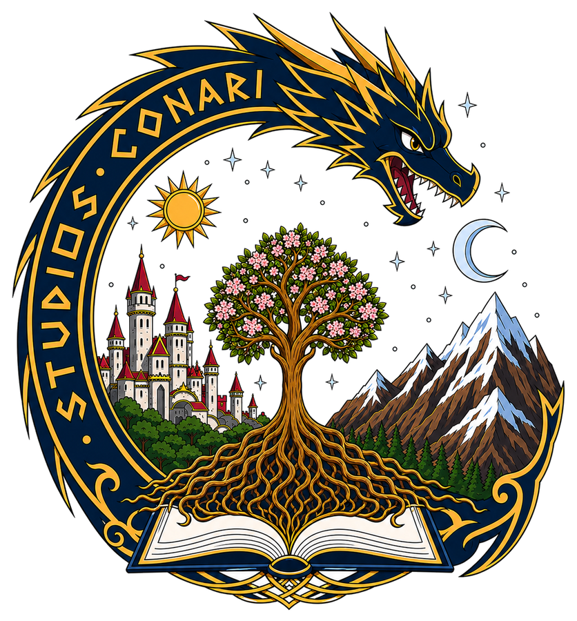
</p>

<p align="center">
  <strong>Studios Conari SpA</strong><br>
  Videojuegos · Narrativa · Diseño · Tecnología · Cultura digital
</p>

<p align="center">
  Creando experiencias interactivas y propiedad intelectual original desde Chile.
</p>

---

<p align="center">
  © 2026 Studios Conari SpA. Todos los derechos reservados.
</p>
